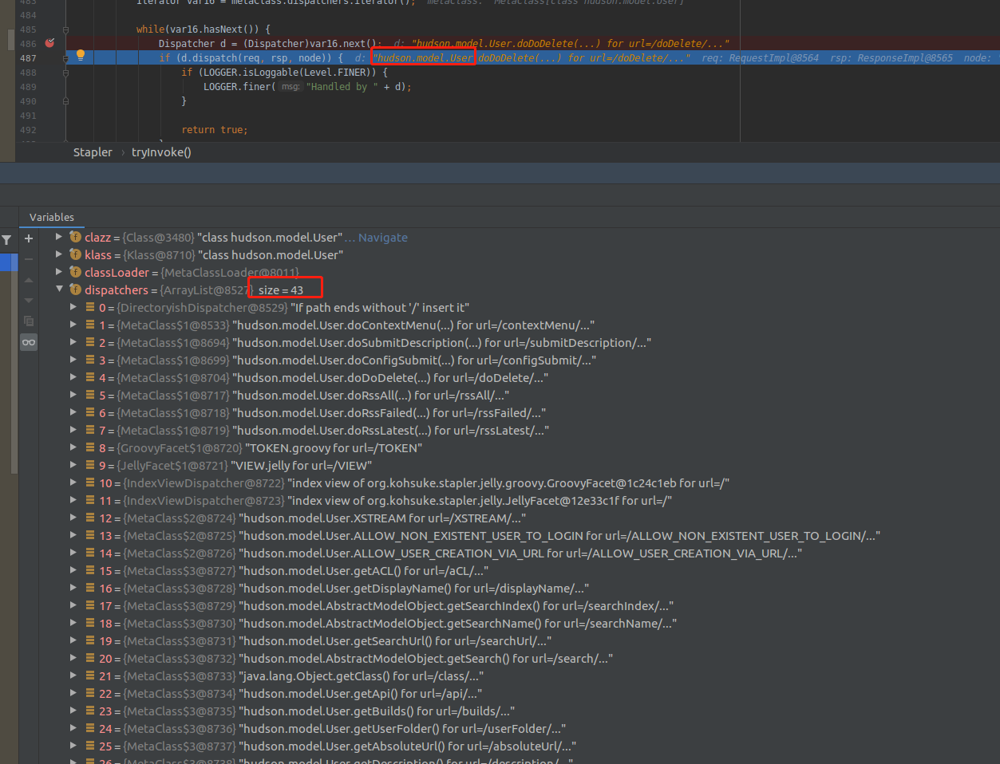
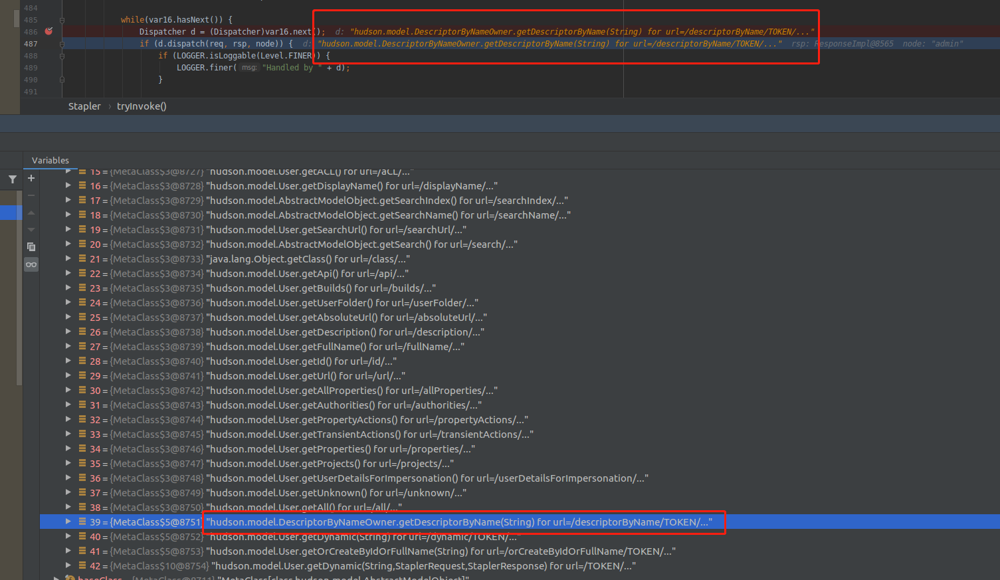
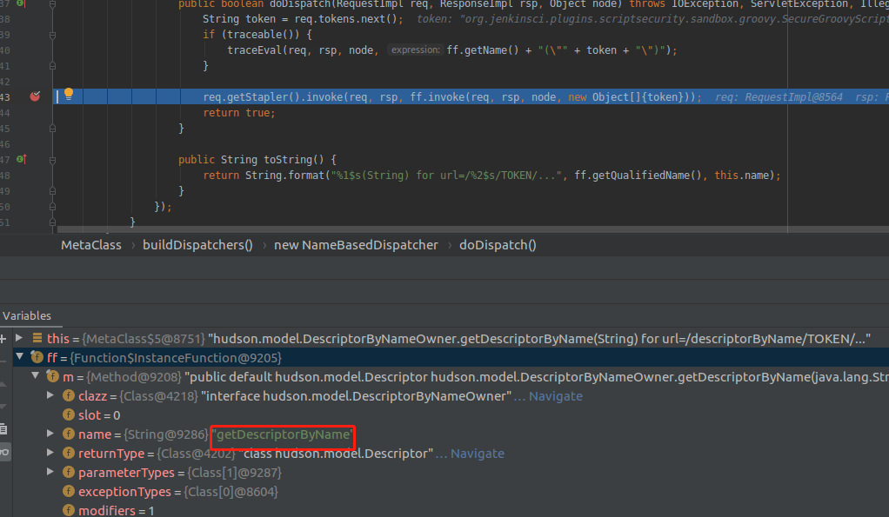
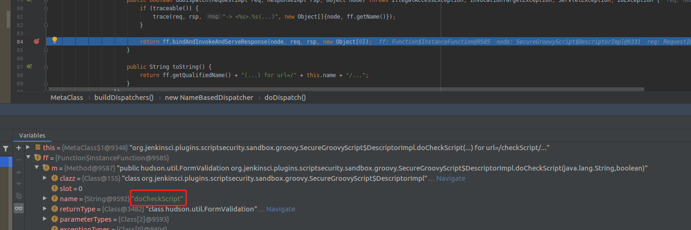
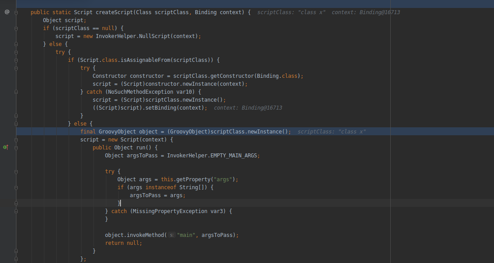

# CVE-2018-1000861


## 前置知识

Jenkins的动态路由


## 分析

每次metaClass的更改发生在此处


### metaClass为hudson.security.HudsonPrivateSecurityRealm

对 /securityRealm 访问时进行动态调试发现，返回的是 Hudson.security.HudsonPrivateSecurityRealm 类


紧接着调用getUser()


### metaClass为hudson.model.User

此时metaClass为hudson.model.User，Dispatchers数量为43个

User 类在 2.138 （2018/8/14 发布）版后做了修改，添加了对接口 StaplerProxy 的实现，然后重写 getTarget 方法，其中加了对读权限的检测。

根据前面的调试过程如果是属于 StaplerProxy 类的实例在 org.kohsuke.stapler.Stapler#tryInvoke 中是会调用到其 getTarget 方法的。

所以这个利用链在 2.138 版后就用不了了。



直到调用到**hudson.model.DescriptorByNameOwner.getDescriptorByName(java.lang.String)**






调用getDescriptorByName()


可以看到，调用getDescriptorByName其实就是调用了 Jenkins.getDescriptorByName，这个函数主要根据传入的 id（String），然后获取到程序中所有继承了 Descriptor 的子类


注意看此时的Object node已经变成了SecureGroovyScript

经过getmetaClass


### metaClass为plugins.scriptsecurity.sandbox.groovy.SecureGroovyScript

此时metaClass为org.jenkinsci.plugins.scriptsecurity.sandbox.groovy.SecureGroovyScript$DescriptorImpl，Dispatchers数量为24个


直到调用doCheckScript()




```
Jenkisn.getSecurityRealm() -> HudsonPrivateSecurityRealm.getUser([username]) -> Jenkins.getDescriptorByName([descriptor_name]) -> org.jenkinsci.plugins.scriptsecurity.sandbox.groovy.SecureGroovyScript.doCheckScript([])
```

这里要调插件因此需要把插件也添加依赖

> doCheckScript:412,SecureGroovyScript$DescriptorImpl(org.jenkinsci.plugins.scriptsecurity.sandbox.groovy)


doCheckScript 方法会将传进来的 command 参数的值当作 Groovy 脚本进行解析

但是它只调用了 parse 方法来解析，真正的RCE在哪里呢？

抱着刨根问底（闲的蛋疼）的心态，往下跟


Groovyshell是用来执行groovy scripts的工具，在其内部中，使用了groovy.lang.GroovyClassLoader在运行时编译并加载classes


这里是它的一些初始化相关的工作，直接跳出来跟parse方法


传入参数为groovy脚本


继续跟入parseClass


调用到doParseClass


这里是对Groovy代码做解析的过程，从codeSource中取出Groovy代码，加入新构建的编译单元。


Groovy编译一共有9个阶段：goalPhase代表编译时要执行到哪一个阶段

```
1、初始化
2、词法分析，生成 CST（具体语法树）
3、CST 转换成 AST（抽象语法树）
4、AST 语义分析
5、AST 分析完成
6、类生成（阶段 1，指令部分）
7、类生成完成
8、输出字节码到硬盘
9、最后阶段，做清理操作
```

编译完成以后，执行createScript方法


在createScript方法中存在新建实例的操作（大概是这么理解的，对groovy不是很熟，orz。。）

**createScript:438, InvokerHelper (org.codehaus.groovy.runtime)**



中间经过一系列的操作


开始调用call

**call:117, AbstractCallSite (org.codehaus.groovy.runtime.callsite)**


PojoMetaMethodSite.class方法中的call方法的invoke方法调用

**invoke:274, PojoMetaMethodSite$PojoMetaMethodSiteNoUnwrapNoCoerce (org.codehaus.groovy.runtime.callsite)**


最后调用Process execute

**execute:533, ProcessGroovyMethods (org.codehaus.groovy.runtime)**


## Reference

https://k1n9.me/2019/02/15/jenkins-cve-2018-1000861.html