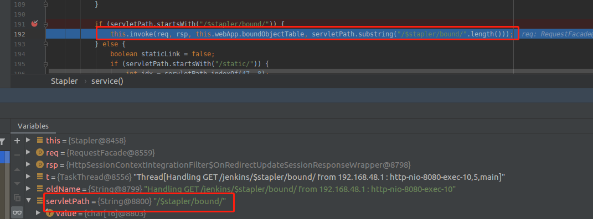
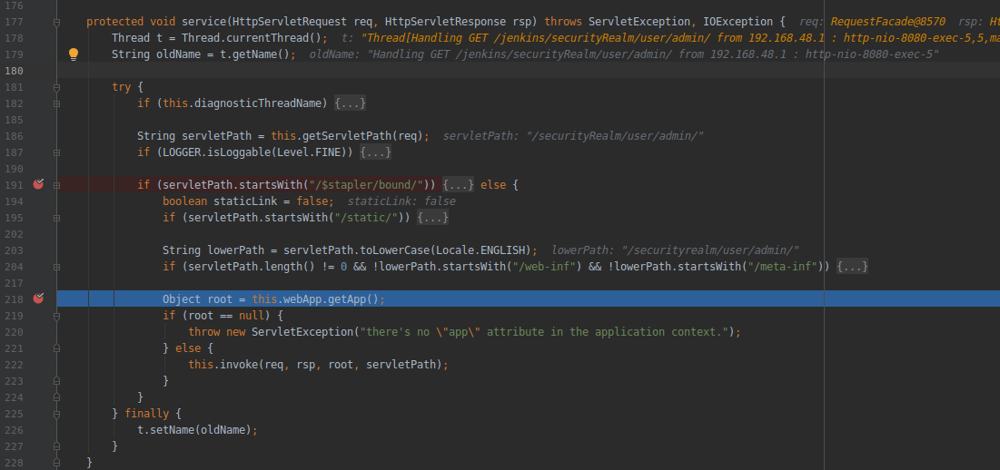
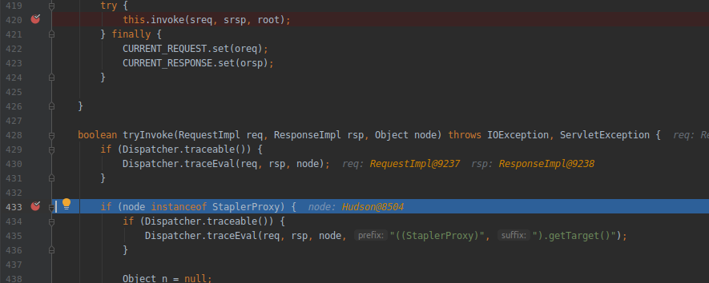
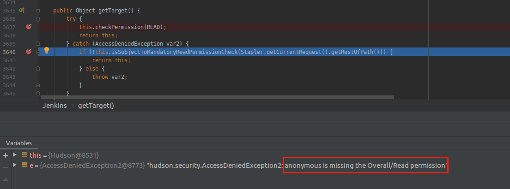
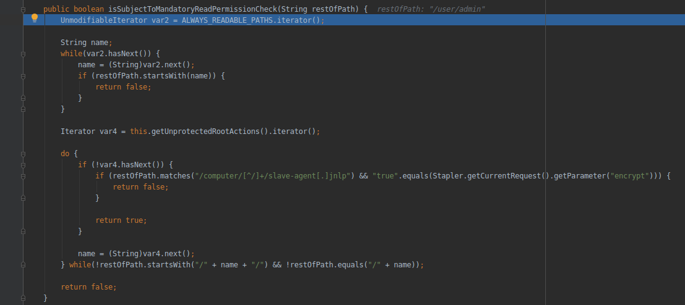
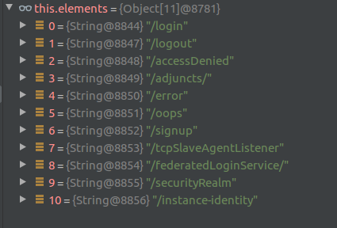
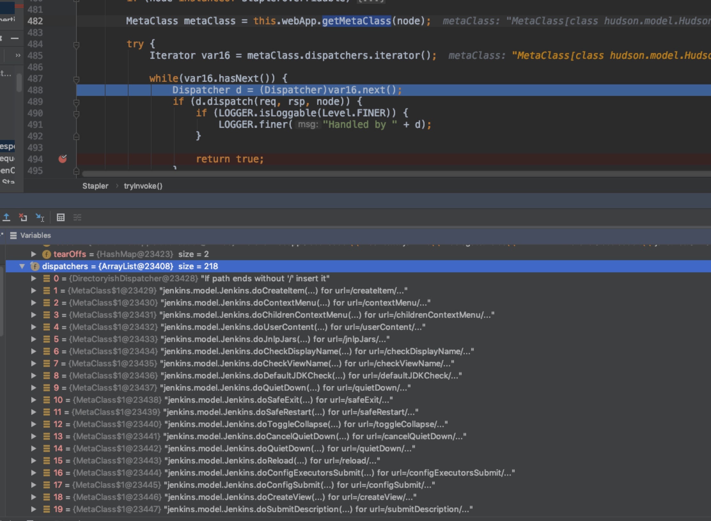

# Stapler请求处理过程（动态）


首先，使用路径和参数信息来定位要使用的对象（webapp），然后使用更多的参数，从而对它执行一些操作（或渲染HTML）


如果url以`/$stapler/bound/开始`



则Object node为this.webApp.boundObjecTable


否则Object node为 hudson.model.Hudson，通过webApp的getApp方法获得Object root，把root作为invoke的形参Object node的实参传入（继承自 jenkins.model.Jenkins）




跟如invoke方法：


调用tryinvoke


跟进tryinvoke中



先通过Dispatcher.traceable()判断是否开启调试记录等设置，然后判断传入的Object对象是不是StaplerProxy类的实例，根节点对象 hudson.model.Hudson 属于 StaplerProxy 类的实例，所以执行会进入到 if 的语句块。


继续往下看


shift+alt+F7跟进getTarget()得到getTarget()来自于

**jenkins-core-2.138.1.jar!/jenkins/model/Jenkins.class**


可以看到这个进行READ权限的检查，如果按照默认设定，默认情况下匿名用户没有任何权限，会被捕获异常



跟进isSubjectToMandatoryReadPermissionCheck方法



对路径进行检查，看是否是以下元素开头



如果能够在这白名单的元素中找到一个元素，可以跳到非白名单上的成员，就可以绕过这个URL的限制，其实同时也绕过了ACL的权限检查。


**Jenkins 的动态路由机制**

假如输入如下URL：

```
http://jenkin.local/adjuncts/whatever/class/classLoader/resource/index.jsp/content
```

将会执行如下：

```
jenkins.model.Jenkins.getAdjuncts("whatever") 
.getClass()
.getClassLoader()
.getResource("index.jsp")
.getContent()
```


根据Orange的文章，使用了/securityRealm来进行


因此绕过了getTarget中的检查，继续tryinvoke的过程


判断Object node是不是StaplerOverridable的实例，不是，继续往下走


getMetaClass方法是获取到根节点对象的所有 Dispatcher

逐个判断



根据监控窗口可以看出来这里的 Dispatcher 有 218 个，Dispatcher 是根据根节点对象中成员变量或方法等生成的，其对应着不同的 url。有如下规则：

```
1. Action 方法
/fooBar/ => node.doFooBar()

2. Public 成员
/fooBar/ => node.fooBar

3. Public Getter 方法
/fooBar/ => node.getFooBar()

4. Public Getter 方法带一个字符串或整数参数
/fooBar/test/ => node.getFooBar(test)
```

一直调用到getsecurityRealm()


用 url 跟 Dispatcher 的名称进行对比，然后再拿 url 剩余的层级数跟参数个数进行了比较，如果剩余层级数大于this.argCount就调用 doDispatch 方法，不然就继续前面的循环。

比如：

```
/securityRealm/user/admin/剩余层级数为2
```

这里的 doDispatch 方法是在生成 Dispatcher 的时候就建立了的，往下跟


 ff 是 org.kohsuke.stapler.Function 类对象，其中保存了根节点对象中方法的各种信息，当调用其 invoke 方法的时候便通过反射来对实际的方法进行调用


返回的结果作为新的根节点对象再进入 org.kohsuke.stapler.Stapler#invoke 执行跟前面一样的流程，一直做递归调用直到把 url 全部解析完


这样便实现了动态路由解析。

如此便明白了这里是存在着任意方法调用的问题的，即使前面看到了有对读权限的检测也可以绕过，如果把这些点串起来就能够形成一个完整的利用链。