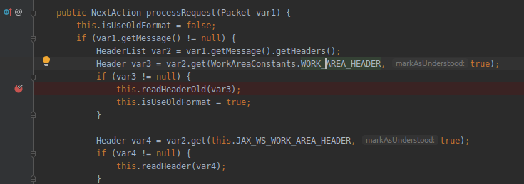
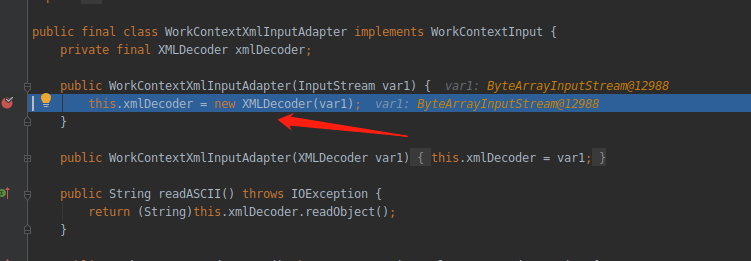

# Weblogic


[TOC]


## 环境搭建

笔者比较喜欢使用docker来搭建各种调试环境，由于weblogic的搭建过于麻烦，所以上网搜索了一下，从github上找到了奇安信大佬们的一个weblogic启环境的repo。

[传送门](https://github.com/QAX-A-Team/WeblogicEnvironment)

### 准备工作：

1. 下载相应版本的JDK放在repo下的`jdks/`目录
2. 下载相应版本的jar包放在repo下的`weblogics/`目录

JDK安装包下载地址：

https://www.oracle.com/technetwork/java/javase/archive-139210.html 

Weblogic安装包下载地址：

https://www.oracle.com/technetwork/middleware/weblogic/downloads/wls-for-dev-1703574.html 


### 构建运行

回到根目录，执行Docker构建镜像命令：

```
docker build --build-arg JDK_PKG=<YOUR-JDK-PACKAGE-FILE-NAME> --build-arg WEBLOGIC_JAR=<YOUR-WEBLOGIC-PACKAGE-FILE-NAME>  -t <DOCKER-IMAGE-NAME> .
```

镜像构建完成后，执行以下命令运行：

```
docker run -d -p 7001:7001 -p 8453:8453 -p 5556:5556 --name <CONTAINER-NAME> <DOCKER-IMAGE-NAME-YOU-JUST-BUILD>
```

以Weblogic12.1.3配JDK 7u21为例，构建镜像命令如下：

```
docker build --build-arg JDK_PKG=jdk-7u21-linux-x64.tar.gz --build-arg WEBLOGIC_JAR=fmw_12.1.3.0.0_wls.jar  -t weblogic12013jdk7u21 .
```

镜像构建完成后，执行以下命令运行：

```
docker run -d -p 7001:7001 -p 8453:8453 -p 5556:5556 --name weblogic12013jdk7u21 weblogic12013jdk7u21
```

运行后可访问`http://localhost:7001/console/login/LoginForm.jsp`登录到Weblogic Server管理控制台，默认用户名为`weblogic`,默认密码为`qaxateam01`


### 远程Debug

把需要调试的目录通过docker compose的volumns或者docker cp的方式copy出来就好，repo中也提供了脚本


需要在`weblogic_install11g.sh`脚本中添加一行

```
yum install -y libnsl
```

否则使用jdk 6u25的时候会报错


下面的大部分CVE所使用的调试环境都是

```
Weblogic10.3.6
Jdk-6u25
IDEA
```


## CVE-2017-10271 Weblogic XMLDecoder反序化


### 漏洞分析

> 漏洞触发位置：wls-wsat.war
>
> 漏洞触发URL：/wls-wsat/CoordinatorPortType（POST）
>
> 漏洞原因综述：wls-wsat.war组件使用了weblogic自带的webservices处理程序来处理SOAP请求， 获取XML数据后传递给XMLDecoder来解析，XMLDecoder可以导致RCE


middleware/wlserver/server/lib/wls-wsat.war!/WEB-INF/web.xml


该漏洞的调用链：

```
<init>:19, WorkContextXmlInputAdapter (weblogic.wsee.workarea)
readHeaderOld:106, WorkContextTube (weblogic.wsee.jaxws.workcontext)
processRequest:43, WorkContextServerTube (weblogic.wsee.jaxws.workcontext)
```


### 调试分析

在` weblogic.wsee.jaxws.workcontext.WorkContextServerTube.processRequest `处接收传递来的XML数据，存在packet对象var1处


packet类在`middleware/modules/glassfish.jaxws.rt_1.3.0.0_2-1-5.jar!/com/sun/xml/ws/api/message/Packet.class`处定义，调用var1的getMessage方法得到message的内容，再调用getHeaders获取到header内容，因此var2里放的就是header的内容。

var2是HeaderList对象，在`middleware/modules/glassfish.jaxws.rt_1.3.0.0_2-1-5.jar!/com/sun/xml/ws/api/message/HeaderList.class`中定义，调用其get方法


获取指定标签内的内容


也就是发送的SOAP内容中的部分

```
<work:WorkContext xmlns:work="http://bea.com/2004/06/soap/workarea/">
…………
</work:WorkContext>
```

把var3作为参数传入readHeaderOld方法中




` weblogic.wsee.jaxws.workcontext.WorkContextTube.readHeaderOld `


在readHeaderOld方法中，创建了WorkContextXmlInputAdapter()对象（即对WorkContextXmlInputAdapter类进行了实例化），带入构造函数的参数即为传入的XML格式序列化数据（其中就包含了我们的payload）。

查看WorkContextXmlInputAdapter类

` weblogic.wsee.workarea.WorkContextXmlInputAdapter `



此处调用了XMLDecoder，而这个函数是可以导致RCE的


### 漏洞复现

poc中的payload如下


执行


成功

